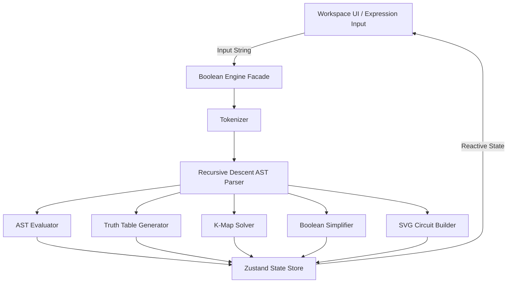

# Architecture & System Design

## 🏛 High-Level System Architecture
BoolStudio is built as a pure client-side Next.js 15 application. State management is powered by Zustand, and UI components are styled using Tailwind CSS and glassmorphism design tokens.

## 📦 Key Modules & Component Boundaries
* `src/lib/parser/`: Tokenizes string expressions and parses them into AST nodes using recursive descent syntax checks.
* `src/lib/logic/`: Evaluates AST nodes against boolean input bindings and constructs hierarchical logic circuits.
* `src/lib/truth-table/`: Computes truth table matrices for $2^N$ variable assignments.
* `src/lib/kmap/`: Builds Gray-code aligned Karnaugh Maps (for up to 4 variables) and solves minterm prime implicant covers.
* `src/lib/simplifier/`: Transforms ASTs step-by-step while recording applied Boolean laws.
* `src/hooks/useBooleanStudio.ts`: Zustand store managing interactive signal states and analysis results.

## 🔄 Data Flow
1. User enters or modifies a Boolean expression in `<ExpressionInput />`.
2. `analyzeBooleanExpression` parses the expression and generates all 4 visualization datasets.
3. The user switches between result tabs (`Truth Table`, `Logic Circuit`, `Karnaugh Map`, `Simplification`).
4. Clicking input badges in the circuit or control bar updates `activeInputValues` in Zustand, recalculating active wire signal glow and truth table row highlights instantaneously.
